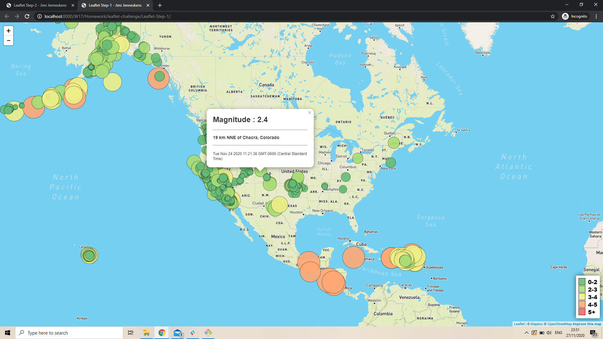

# Leaflet-challenge
## Contributor
* Jimi Jenneskens

---
Table of contents 

1. [Level 1 - Leaflet-Step-1](#1)
2. [Level 2 - Leaflet-Step-2](#2)

---

### Level 1 - Leaflet-Step-1 
#### Core assignment: Created a map using Leaflet that plots all of the tracked earthquakes of the last 7 days based on their longitude and latitude.
[Go back to the table of contents](#toc)

##### Files

* index.html -- Leaflet-Step-1 webpage (marked with tracked earthquakes of last 7 days).
* static/css/style.css -- style sheet for webpage.
* static/js/logic.js -- JavaScript for index.html webpage functionality.

### Level 2 - Leaflet-Step-2 
#### Bonus assignment: Created a number of base maps to choose from and two different overlays (Earthquakes in past 7 days and Fault Lines)
[Go back to the table of contents](#toc)

##### Files

* index.html -- Leaflet-Step-1 webpage (marked with tracked earthquakes of last 7 days overlay, Fault Line overlay and different base maps to choose from).
* static/css/style.css -- style sheet for webpage.
* static/js/logic.js -- JavaScript for index.html webpage functionality.

##### Screenshot Leaflet-Step-1

##### Screenshot Leaflet-Step-2

